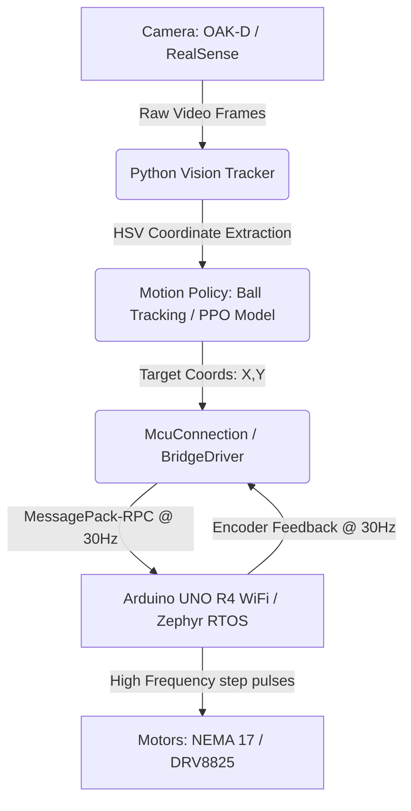

# 🏓 Roboklask: Autonomous AI-Powered Klask-Playing Robot

English | [日本語](./README_ja.md)

[](https://www.python.org/downloads/)
[](https://zephyrproject.org/)
[](https://store.arduino.cc/)
[](https://github.com/astral-sh/uv)
[](https://github.com/astral-sh/ruff)

Roboklask is an autonomous, real-time robotics system designed to play **Klask**—a fast-paced, magnetic table hockey game. Combining high-speed computer vision, an ONNX-optimized reinforcement learning agent (PPO), and low-latency motor control, Roboklask plays autonomously against human opponents.

[**👉 日本語版のREADMEはこちら (README_ja.md)**](./README_ja.md)

---

## 📸 Demo & Hardware Overview

*(Place your robot gameplay video or GIF here!)*


### The Hardware Setup
* **Structure**: Custom 2D H-bot XY Gantry.
* **Actuators**: High-torque NEMA 17 Stepper Motors driven by DRV8825 motor drivers (configured at 1/8 microstepping).
* **Brain**: Arduino UNO R4 WiFi running Zephyr RTOS.
* **Vision**: OAK-D (DepthAI) or Intel RealSense stereo cameras capturing the table dynamics at 30+ FPS.

---

## ✨ Features

- 🧠 **PPO Reinforcement Learning**: Runs real-time inference on a Proximal Policy Optimization model (`klask_ppo_model.onnx`) via ONNX Runtime to make movement decisions.
- ⚡ **Low-Latency step control**: Powered by Zephyr RTOS, achieving step frequencies of up to **16,000 steps/sec** with **25,600 steps/sec²** acceleration.
- 🔌 **Unified MessagePack-RPC**: Low-overhead serial communication running at 30Hz, passing targets and receiving coordinate feedback synchronously.
- 🎯 **Robust Computer Vision**: Real-time HSV-based blue color tracking that automatically calibrates itself to detect the board, ball, and striker under dark lighting conditions.
- 🛡️ **Auto-Recalibration**: Dynamic limit switch detection (`resetX`/`resetY`) that recalibrates coordinate origins on the fly without stopping the game.

---

## 🛠️ System Architecture



> [!TIP]
> For a detailed look at our RTOS optimizations, serial-buffer flushing, and kinematics math, see the **[Technical Optimizations & Engineering Details](./docs/optimizations.md)** document.

---

## 💻 Quickstart (Arduino App Lab)

Simply open this project in Arduino App Lab!

## 🛠️ Alternative Setup (For Debugging / Development)

This project uses [mise](https://mise.jdx.dev/) as a polyglot task runner and environment manager.

### 1. Installation
Clone the repository and sync python dependencies:
```sh
git clone https://github.com/motty-mio2/roboklask.git
cd roboklask/python
uv sync
```

### 2. Compile and Upload Firmware
Compile the C++ Arduino sketch:
```sh
cd ../sketch
mise run build
```

### 3. Run the AI Agent
Start the vision loop (requires a camera and serial connection):
```sh
cd ../python
uv run python run_vision.py
```

### 4. Run Formatting & Lints
Keep the codebase clean:
```sh
mise run format   # Format Python & C++ source files
mise run lint     # Strict C++ static analysis and python type checks
```

---

## 📁 Repository Structure

- **[`sketch/`](./sketch/)** — Arduino C++ firmware targeting Arduino UNO R4 (UNO Q / Minima) for dual stepper motor control and sensor integration.
- **[`python/`](./python/)** — Python companion app (Python 3.13) for vision tracking (OAK-D / RealSense), motion policy inference (PPO / Ball tracking), and web UI.
- **[`hardware/`](./hardware/)** — 3D printable mechanical parts and mount designs.
  - **[Hardware & 3D Printing Guide](./hardware/HardWare.md)** ([日本語版](./hardware/HardWare_ja.md))
- **[`docs/`](./docs/)** — Technical engineering documentation and RTOS optimization details.

## 📚 Documentation

- **[Hardware & 3D Printing Guide](./hardware/HardWare.md)**: STL files, recommended BambuLab P1S print settings, and parts list.
- **[Python Package Documentation](./python/README.md)**: Setup and usage for the vision tracking and motion control application.
- **[Technical Optimizations & Engineering Details](./docs/optimizations.md)**: RTOS optimizations, serial-buffer flushing, and kinematics math.

## 🔗 Related Repositories

- [Klask_PCB](https://github.com/motty-mio2/Klask_PCB): Custom designed shield for Arduino UNO Q
- [Klask Vision](https://github.com/motty-mio2/Klask_vision): Computer vision inference package for Klask
  - [Klask Vision Learning](https://github.com/motty-mio2/Klask_vision_learning): Training pipeline for Klask vision models
- [Klask RL](https://github.com/motty-mio2/Klask_RL): Reinforcement learning agent for Klask
