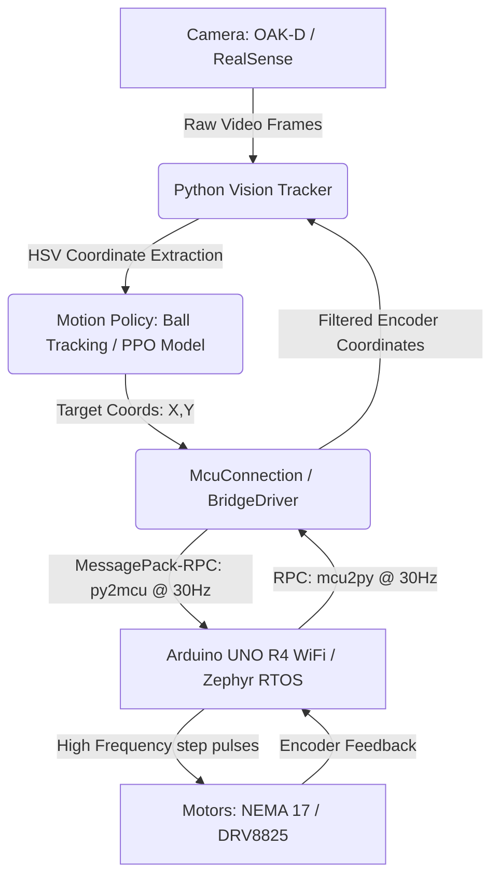

# 🏓 Roboklask: Autonomous AI-Powered Klask-Playing Robot

Welcome to **Roboklask**, a real-time, hardware-in-the-loop autonomous robotics system designed to play **Klask**—a magnetic table hockey game. 

This repository contains both the high-performance Arduino R4 firmware and the Python 3.13 computer vision / reinforcement learning companion app. The system utilizes real-time HSV tracking, an ONNX-optimized PPO (Proximal Policy Optimization) model, and low-latency Zephyr RTOS serial communications to achieve precise, lightning-fast striker control.

---

## 🚀 Key Engineering Highlights

### ⚡ Low-Latency & High-Frequency Step Generation (Zephyr RTOS)
* **Custom Polling Loop**: The Arduino UNO R4 WiFi firmware runs on top of the Zephyr RTOS kernel. By bypassing the standard Arduino `loop()` return overhead through an internal `while(true)` infinite polling architecture, the firmware polls `AccelStepper::run()` at tens of kilohertz. This enables a step pulse output frequency of up to **16,000 steps/second** (with 1/8 microstepping resolution) and **25,600 steps/second²** acceleration.
* **Thread Starvation Guard**: To prevent the RTOS communication and network threads from starving, a controlled `k_yield()` is triggered exactly once every 1 millisecond inside the high-frequency step generator loop.

### 🔌 Consolidated MessagePack-RPC over Serial
* **Consolidated Commands**: To minimize serial overhead (default: 115200bps), target striker coordinate updates and target ball coordinates are consolidated into a single custom RPC call (`py2mcu(tx, ty, bx, by)`), halving the number of transmitted packets.
* **Queuing & Buffer Overflow Elimination**: Standard asynchronous MessagePack `notify` can cause packet congestion when the receiver falls behind. We solved this by implementing an active serial-buffer guard (`Serial1.available() > 0`) that triggers synchronized `safeUpdate()` calls during idle time, completely eliminating latency accumulation.

### 🎯 High-Accuracy Calibration & Auto-Recovery
* **Split Axis Calibration**: The physical limit switch release distance (`PHYSICAL_BACK = 300` steps) is split from the software boundary margins (`STEP_BACK_X`, `STEP_BACK_Y`). This maximizes the striker's physical range of motion (`XSTEP=2900`, `YSTEP=1400`) while preserving absolute homing safety.
* **Auto-Calibration & Escape Math**: If a collision is detected during normal operation, the motors immediately trigger an escape sequence (backing off by `STEP_BACK_X`/`Y` steps) and dynamically recalibrate the MCU's internal step coordinates on the fly.

### 🧠 Vision & Reinforcement Learning (Python)
* **HSV-based Blue Tracking**: Automatic field calibration optimized for dark lighting conditions. Detects coordinates of the board, ball, and striker.
* **ONNX Inference Pipeline**: Evaluates the PPO model (`klask_ppo_model.onnx`) at **30Hz** (33ms interval) via ONNX Runtime using raw tracking coordinate inputs.

---

## 🛠️ System Architecture



* **`sketch/`**: C++ firmware targeting `arduino:zephyr:unoq` (Arduino UNO R4 WiFi) or `arduino:samd:minima` (Arduino UNO R4 Minima).
* **`python/`**: Python 3.13+ companion application managed with `uv` containing vision pipeline and PPO model inference.

---

## 💻 Setup & Installation

The project uses [mise](https://mise.jdx.dev/) as a polyglot task runner to manage environments.

### 1. Prerequisite Toolchain
Ensure you have `mise`, `git`, and `arduino-cli` installed.

### 2. Python Environment Setup
```sh
cd python
uv sync                  # Installs python virtualenv and dependencies
mise run export          # Generates requirements.txt from uv.lock
```

### 3. Compile Firmware
```sh
cd sketch
mise run build           # Compiles firmware for Arduino R4 (UNO Q)
```

---

## 🎮 How to Run

### Run Formatting and Lints
```sh
mise run format          # Runs clang-format, ruff format, and tombi format
mise run lint            # Runs cppcheck, clang-format dry-run, ruff check, and pyright check
```

### Start the Vision & Motion Inference Pipeline
Ensure your camera is connected via USB.
```sh
cd python
uv run python run_vision.py
```

### Start Web UI (Manual Stepper Bridge Control)
```sh
cd python
uv run python main.py
```

---

## ⚙️ Configuration (`.env`)
All configuration variables are prefixed with `KLASK_` and defined in `python/src/viewer/config.py`:
- `KLASK_OUTPUT_TYPE`: Communication channel (`none` / `uart` / `bridge`).
- `KLASK_POLICY_TYPE`: Motion Strategy (`ball_tracking` / `ppo`).
- `KLASK_CAMERA`: Camera Hardware (`oakd` / `realsense`).
- `KLASK_CONFIDENCE_THRESHOLD`: Object detection confidence threshold (defaults to `0.5`).
