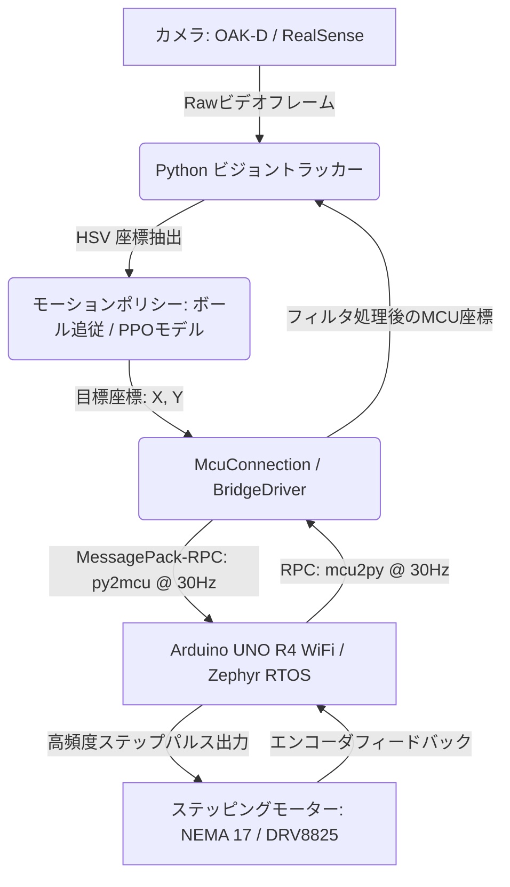

# 🏓 Roboklask: AI駆動型 Klask 自律対戦ロボット

**Roboklask** は、磁石を用いたテーブルホッケーゲーム **「Klask（クラスク）」** を自律プレイするために設計された、リアルタイムのハードウェア・イン・ザ・ループ（HIL）型ロボットシステムです。

このリポジトリには、超高速・低遅延なステップパルス生成を実現する Arduino R4 ファームウェアと、PPO（近接方策最適化）強化学習モデルの推論およびHSVカラー検出によるビジョントラッキングを実行する Python 3.13 アプリケーションが含まれています。

---

## 🚀 技術的なハイライト（ここがすごい！）

### ⚡ Zephyr RTOS 上での極限の超低遅延・高頻度ステップパルス生成
* **独自ポーリングループによるオーバーヘッド回避**: Arduino UNO R4 WiFi ファームウェアは Zephyr RTOS 上で動作しています。標準の Arduino `loop()` が `return` して再起動する際に生じるコアシステムの莫大なオーバーヘッド（数百μs〜ミリ秒単位）を回避するため、内部で **`while(true)` による無限ポーリングループ** を実装しました。
* **16,000 steps/sec の超高速駆動**: これにより、ステップ更新関数 `AccelStepper::run()` を数十kHzの周波数でポーリングし続けることが可能になり、1/8ステップ解像度において最大 **`16,000 steps/sec` (秒速 約200mm) の最高速度** と、**`25,600 steps/sec²` の最大加速度** を 100% 維持して滑らかに制御します。
* **スレッド飢餓防止の調停（k_yield）**: 無限ループによる RTOS の通信・ネットワークスレッドの飢餓（ハングアップ）を防ぐため、1ミリ秒に1回だけ正確に `k_yield()` を呼び出してCPU時間を他スレッドに明け渡す調停ロジックを搭載しています。

### 🔌 シリアル通信バッファ溢れ（キューイング遅延）の完全排除
* **MessagePack-RPC パケットの統合**: 送信パケット数を半減させて 115200bps のシリアル帯域を圧迫しないよう、目標座標 (`tx, ty`) とボール座標 (`bx, by`) を1つの RPC メッセージ（`py2mcu`）に完全に統合しました。
* **同期受信ガード（safeUpdate）**: 応答を待たない非同期の `notify` による受信バッファの滞留（Python を止めてもしばらくロボットが遅れて動き続ける現象）を解決するため、メインスレッドの空き時間でシリアルバッファの有無を検知 (`Serial1.available() > 0`) し、同期的に `safeUpdate()` を実行することでパケットの遅延蓄積をゼロにしました。

### 🎯 高精度キャリブレーションと動的座標補正（オートリカバリー）
* **X/Y独立のソフトウェアマージン**: リミットスイッチ検出時の物理的な離脱距離（`PHYSICAL_BACK = 300`）と、ソフト側の可動限界マージン（`STEP_BACK_X`, `STEP_BACK_Y`）を独立定義しました。これにより、安全性を担保しつつ、ストライカーの物理可動範囲（`XSTEP = 2900`, `YSTEP = 1400`）を限界まで広げています。
* **激突回避と原点動的再キャリブレーション**: 運転中に不意にリミットスイッチが反応した場合、モーターは即座に停止して `STEP_BACK` 分だけ逃げる方向に退避し、座標のズレをその場で逆算してマイコン内の絶対座標を自動で再キャリブレーション（`resetX/Y`）してシームレスにプレイを続行します。

### 🧠 高速ビジョン認識とリアルタイム強化学習推論 (Python)
* **HSVベースのロバストなトラッキング**: 暗い照明環境でも安定して盤面・ボール・ストライカーを検出できる、自動HSVカラーキャリブレーション機能を実装。
* **PPOモデルの ONNX 高速推論**: Python の ONNX Runtime を使用し、カメラのフレームレートに完全に同期した **30Hz** (33ms 周期) で強化学習（PPO）エージェントモデル（`klask_ppo_model.onnx`）をリアルタイム推論し、即座にターゲット座標をロボットへ送信します。

---

## 🛠️ システム構成図



* **`sketch/`**: `arduino:zephyr:unoq`（Arduino UNO R4 WiFi）または `arduino:samd:minima`（Arduino UNO R4 Minima）ターゲットの C++ ファームウェア。
* **`python/`**: `uv` によって管理される、ONNX推論および追跡用の Python 3.13 アプリケーション。

---

## 💻 セットアップ & インストール

多言語開発環境マネージャーである [mise](https://mise.jdx.dev/) を使用してビルド環境を統一しています。

### 1. 必要ツールのセットアップ
あらかじめ `mise`, `git`, `arduino-cli` をインストールしておいてください。

### 2. Python 仮想環境の構築
```sh
cd python
uv sync                  # 仮想環境と依存ライブラリの自動インストール
mise run export          # uv.lock から requirements.txt を生成
```

### 3. ファームウェアのビルド
```sh
cd sketch
mise run build           # Arduino R4 WiFi (UNO Q) 向けのコンパイル
```

---

## 🎮 起動方法

### コードのフォーマットと静的解析 (Lint)
```sh
mise run format          # clang-format, ruff format, tombi format の一括適用
mise run lint            # cppcheck, ruff check, pyright による厳格な型チェック (2秒で走ります)
```

### ビジョン追跡 ＆ 強化学習推論パイプラインの起動
カメラを USB で接続し、以下のコマンドを実行します。
```sh
cd python
uv run python run_vision.py
```

### Web UI (手動モーター制御画面) の起動
```sh
cd python
uv run python main.py
```

---

## ⚙️ 設定オプション (`.env`)
すべての設定変数は `KLASK_` プレフィックスを持ち、`python/src/viewer/config.py` で管理されています。
* `KLASK_OUTPUT_TYPE`: 通信チャンネルの指定 (`none` / `uart` / `bridge`)
* `KLASK_POLICY_TYPE`: 動作ポリシーの指定 (`ball_tracking` / `ppo`)
* `KLASK_CAMERA`: カメラハードウェアの指定 (`oakd` / `realsense`)
* `KLASK_CONFIDENCE_THRESHOLD`: 物体検出の信頼度閾値（デフォルト `0.5`）
