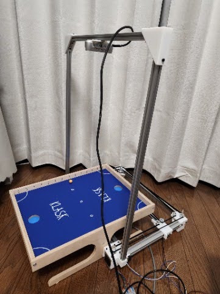
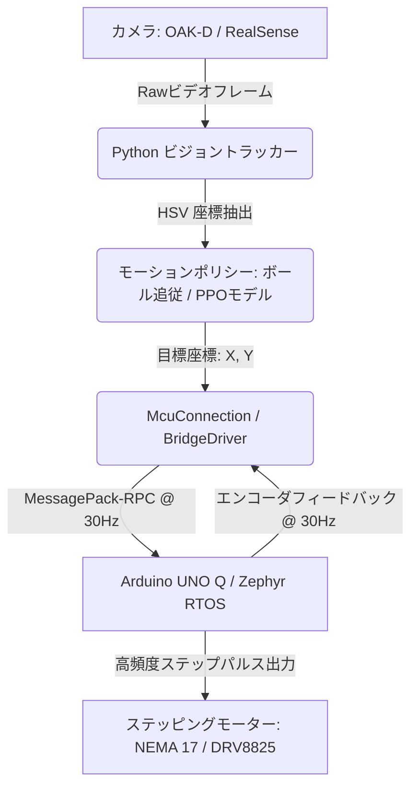

# 🏓 Roboklask: AI駆動型 Klask 自律対戦ロボット

[](https://www.python.org/downloads/)
[](https://zephyrproject.org/)
[](https://store.arduino.cc/)
[](https://github.com/astral-sh/uv)
[](https://github.com/astral-sh/ruff)

Roboklask は、磁石で操作するアクションボードゲーム **「Klask（クラスク）」** を自律プレイするために設計された、リアルタイムのハードウェア・イン・ザ・ループ（HIL）型ロボットシステムです。高速な画像認識、ONNX に最適化された強化学習モデル（PPO）、および低遅延のモーター制御技術を統合し、人間とリアルタイムに対戦します。

[**👉 Click here for the English README.md**](./README.md)

---

## 📸 デモ ＆ ハードウェア概要

*(ここにロボットのプレイ動画やGIFを貼り付けてください！)*


### ハードウェア構成
* **機構**: 2自由度の H-bot リンク式 XY ガントリー。
* **アクチュエータ**: NEMA 17 ステッピングモーター ＆ DRV8825 モータードライバ (1/8マイクロステップ設定)。
* **制御マイコン**: Arduino UNO Q（OSとして Zephyr RTOS を採用）。
* **ビジョンカメラ**: OAK-D (DepthAI) または Intel RealSense ステレオカメラ (30+ FPS)。

---

## ✨ 主な機能

- 🧠 **強化学習推論 (PPO)**: ONNX Runtime を使用し、近接方策最適化（PPO）エージェントモデル（`klask_ppo_model.onnx`）をリアルタイム推論。
- ⚡ **超低遅延ステップ生成**: Zephyr RTOS のタスク制御により、最大 **16,000 steps/sec** のステップ周波数と **25,600 steps/sec²** の加速度を実現。
- 🔌 **MessagePack-RPC 通信**: 30Hz（33ms）周期で、目標座標の指令とエンコーダ座標フィードバックを同期通信。
- 🎯 **ロバストな画像認識**: 暗い照明環境でも動作する、HSVカラーベースのボール・ストライカー自動トラッキング＆盤面自動キャリブレーション。
- 🛡️ **動的座標補正（オートリカバリー）**: 運転中にリミットスイッチが押されても、瞬時に安全方向に逃げて座標の原点を自動で再キャリブレーション（`resetX`/`resetY`）し、ゲームを中断せず復帰。

---

## 🛠️ システム構成図



> [!TIP]
> RTOSのポーリング最適化、RPCシリアルバッファの遅延対策、キネマティクス計算などの深い技術的な工夫については、**[技術解説 ＆ 最適化詳細 (optimizations_ja.md)](./docs/optimizations_ja.md)** をご覧ください。

---

## 💻 クイックスタート

本プロジェクトは、多言語開発環境の管理に [mise](https://mise.jdx.dev/) を、Pythonのパッケージ管理に `uv` を採用しています。

### 1. インストール
リポジトリをクローンし、Pythonの依存パッケージをインストールします：
```sh
git clone https://github.com/motty-mio2/roboklask.git
cd roboklask/python
uv sync
```

### 2. ファームウェアの書き込み
Arduino C++ ファームウェアをコンパイルします：
```sh
cd ../sketch
mise run build
```

### 3. AIエージェントの起動
ビジョンループとロボット通信をスタートします（カメラとシリアルポートの接続が必要です）：
```sh
cd ../python
uv run python run_vision.py
```

### 4. フォーマット ＆ リンター実行
コード品質を維持するためのチェックを実行します：
```sh
mise run format   # Python ＆ C++ コードの自動フォーマット
mise run lint     # C++ 静的解析 ＆ Python の厳密な型チェック
```

---

## 📁 ディレクトリ構造

* **`sketch/`**: Arduino UNO Q 向けのファームウェア。
* **`python/`**: 推論、トラッキング、Web UI を含む Python アプリケーション。
* **`docs/`**: 詳細な技術ドキュメント。

## 関連リポジトリ

- [Klask_PCB](https://github.com/motty-mio2/Klask_PCB)：独自設計のArduino UNO Q用Shield
- [Klask Vision](https://github.com/motty-mio2/Klask_vision)：Klask用画像認識モデルの推論パッケージ
  - [Klask Vision Learning](https://github.com/motty-mio2/Klask_vision_learning)：Klask用画像認識モデルの学習用
- [Klask RL](https://github.com/motty-mio2/Klask_RL)：Klask用強化学習エージェント