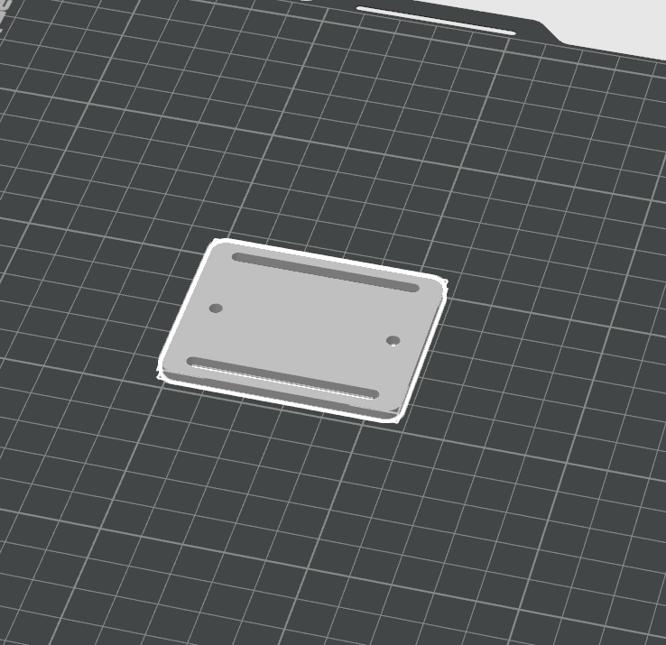
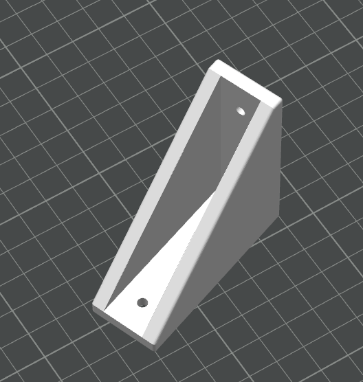
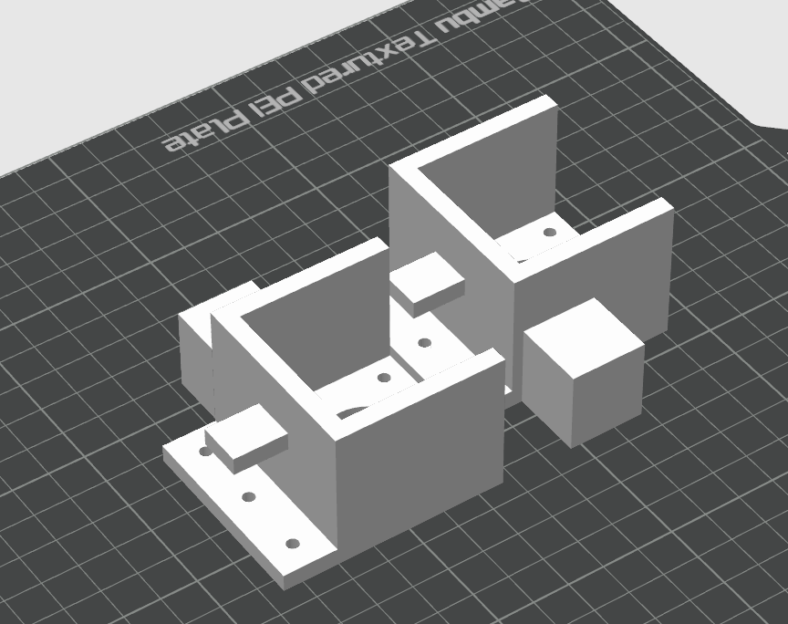
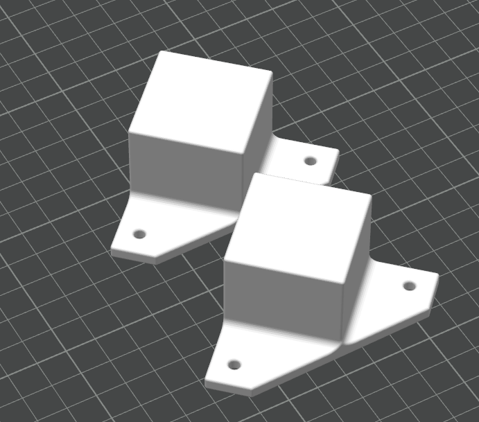
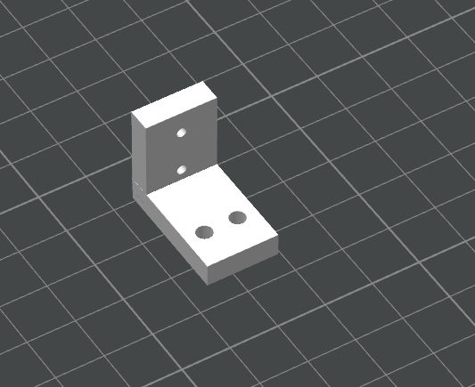
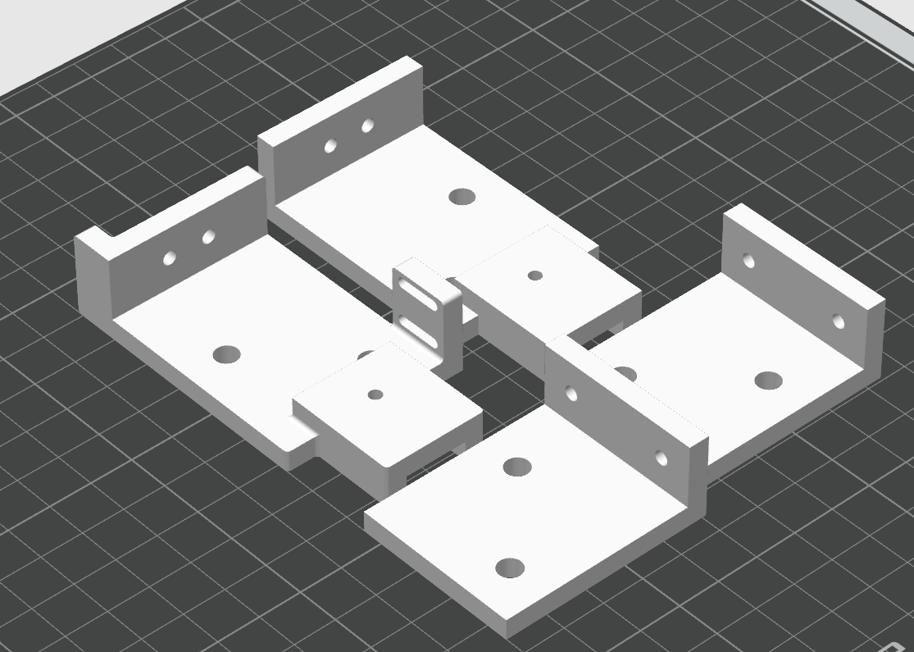
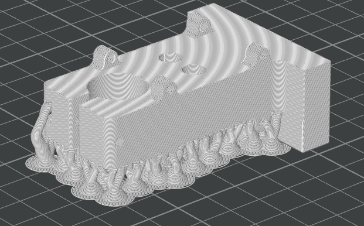
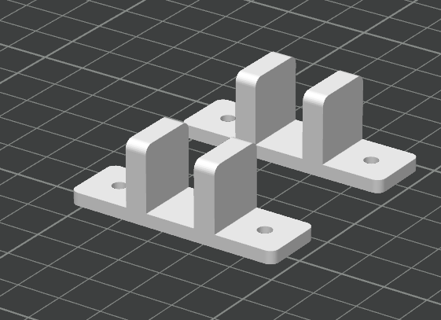

# ハードウェアについて

[English](HardWare.md) | [日本語](HardWare_ja.md)

ここには、3Dプリントするハードウェアのモデルデータおよび印刷情報を記載します。  
掲載している各パーツの画像は、スライサーでの**推奨する印刷の向き**を示しています。

## 推奨印刷設定（BambuLab P1S）

モータマウンタ以外のパーツは、すべて共通の設定で印刷可能です。

### 1. 共通設定（モータマウンタ以外）

Bambu Studio の標準プリセット **`0.20mm Standard`** をベースにし、サポート設定のみ追加しています。

- **推奨素材**: PLA
- **ベースプリセット**: `0.20mm Standard`
- **サポート**:
  - **サポート有効化**: ON
  - **タイプ**: **ツリー（Tree）**
  *(※オーバーハングがある形状も自動ツリーサポートで安定して印刷できます)*

### 2. モータマウンタ設定

Bambu Studio の標準プリセット **`0.20mm Strength`** を使用します。壁ループ数やインフィルがあらかじめ強度重視に設定されています。

- **推奨素材**: PETG または ABS（モータの締め付けや振動・負荷がかかるため高強度フィラメントを推奨）
- **ベースプリセット**: `0.20mm Strength`
- **サポート**:
  - **サポート有効化**: ON（ツリーサポート推奨）
  - BambuLabのサポート用フィラメント（Support for PLA/PETG等）を使用すると、インターフェース層が剥がしやすく美しく仕上がります

---

## 3Dプリントパーツ一覧

| 部品名                       | ファイル                                       | 数量  |  印刷設定（プリセット）  | 特記事項                     |
| :--------------------------- | :--------------------------------------------- | :---: | :----------------------: | :--------------------------- |
| **RealSenseマウンタ**        | [RealSenseMounter.stl](./RealSenseMounter.stl) |   1   | 0.20mm Standard (ツリー) | サポート不要                 |
| **カメラホルダー治具**       | [CameraAngle.stl](./CameraAngle.stl)           |   2   | 0.20mm Standard (ツリー) | サポート不要                 |
| **モータマウンタ L**         | [MotorMount_L.stl](./MotorMount_L.stl)         |   1   |   **0.20mm Strength**    | PETG/ABS推奨・サポート材推奨 |
| **モータマウンタ R**         | [MotorMount_R.stl](./MotorMount_R.stl)         |   1   |   **0.20mm Strength**    | PETG/ABS推奨・サポート材推奨 |
| **脚**                       | [Leg.stl](./Leg.stl)                           |   2   | 0.20mm Standard (ツリー) | サポート不要                 |
| **リミットスイッチマウント** | [LimitSwitchMount.stl](./LimitSwitchMount.stl) |   1   | 0.20mm Standard (ツリー) | サポート不要                 |
| **プーリーマウント A_L**     | [PulleyMountA_L.stl](./PulleyMountA_L.stl)     |   1   | 0.20mm Standard (ツリー) | -                            |
| **プーリーマウント A_R**     | [PulleyMountA_R.stl](./PulleyMountA_R.stl)     |   1   | 0.20mm Standard (ツリー) | -                            |
| **プーリーマウント B**       | [PulleyMountB.stl](./PulleyMountB.stl)         |   1   | 0.20mm Standard (ツリー) | -                            |
| **プーリーマウント C**       | [PulleyMountC.stl](./PulleyMountC.stl)         |   1   | 0.20mm Standard (ツリー) | -                            |
| **アームホルダー**           | [Arm_Holder.stl](./Arm_Holder.stl)             |   1   | 0.20mm Standard (ツリー) | サポート多・サポート材推奨   |
| **ストッパー**               | [Stopper.stl](./Stopper.stl)                   |   2   | 0.20mm Standard (ツリー) | サポート不要                 |

---

## 各パーツ詳細

### カメラ系

- [RealSenseマウンタ](./RealSenseMounter.stl)
  - 数量: 1つ
  - 設定: 共通設定
  
  
- [カメラホルダー治具](./CameraAngle.stl)
  - 数量: 2つ
  - 設定: 共通設定
  
  
### 本体系

- モータマウンタ
  - [MotorMount_L.stl](./MotorMount_L.stl) (L側: 1つ)
  - [MotorMount_R.stl](./MotorMount_R.stl) (R側: 1つ)
  - 設定: **モータマウンタ設定（0.20mm Strength）**
  - 力がかかるため、インフィル密度を高くするか、ABSやPETGなどの強度のあるフィラメントを使用することを推奨します
  - BambuLabのサポート用フィラメントがあると美しく仕上がります
  
  
- [脚](./Leg.stl)
  - 数量: 2つ
  - 設定: 共通設定
  
  
- [リミットスイッチマウント](./LimitSwitchMount.stl)
  - 数量: 1つ
  - 設定: 共通設定
  
  
- プーリーマウント
  - [PulleyMountA_L.stl](./PulleyMountA_L.stl) (1つ)
  - [PulleyMountA_R.stl](./PulleyMountA_R.stl) (1つ)
  - [PulleyMountB.stl](./PulleyMountB.stl) (1つ)
  - [PulleyMountC.stl](./PulleyMountC.stl) (1つ)
  - 設定: 共通設定
  
  
- [アームホルダー](./Arm_Holder.stl)
  - 数量: 1つ
  - 設定: 共通設定
  - サポートの分量が非常に多くなります
  - サポート用フィラメントの使用を強く推奨します
  
  
- [ストッパー](./Stopper.stl)
  - 数量: 2つ
  - 設定: 共通設定
  
